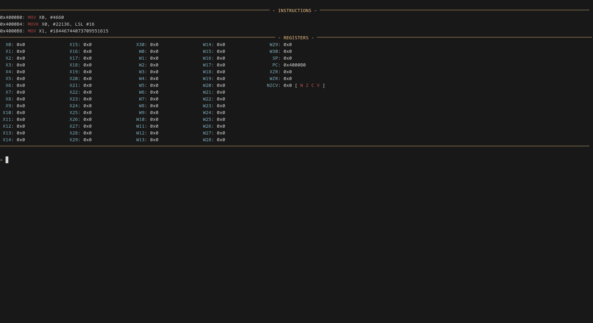

# ARM64 CPU Emulator


An experimental ARM64 CPU emulator written in Rust.

## Table of Contents

* [Installation](#installation)

  * [Install via Cargo (recommended)](#install-via-cargo-recommended)
  * [Build from source](#build-from-source)
* [Configuration](#configuration)
* [Debug View](#debug-view)

  * [Available Commands](#available-commands)
* [License](#license)

## Quick Start

Save this file as `hello.s`:
```asm
.data
msg:
    .byte 72, 101, 108, 108, 111, 44, 32, 119, 111, 114, 108, 100, 33, 10

.text
.global _start

_start:
    MOV X0, #1
    LDR X1, =msg
    MOV X2, #14
    MOV X8, #64
    SVC #0
    MOV X8, #93
    MOV X0, #0
    SVC #0
```

Assemble it:
```bash
# If you are in x86
aarch64-linux-gnu-as -o hello.o hello.s
aarch64-linux-gnu-ld -o hello hello.o

# If you are in ARM
as -o hello.o hello.s
ld -o hello hello.o
```

Save this as `config.toml`:
```toml
[config]
binary = "hello"
memory = "10MB"

[debugview]
debugmode = false
```

And run `armemu`!

## Installation

### Install via Cargo (recommended)

```bash
cargo install armemu
```

### Build from source

```bash
git clone https://github.com/parssarica/armemu.git
cd armemu
cargo build --release
cp target/release/armemu ~/.cargo/bin/
```

## Configuration

The emulator is configured using a TOML file with the following fields:

```toml
[config]
code = "asmfiles/assembly05.asm"
memory = "10MB"

[debugview]
debugmode = false
```

This configuration runs the code in `asmfiles/assembly05.asm` with 10 MB of memory.

## Debug View

The debug view is a special interface that displays instructions and register states. It can be enabled or disabled using the `debugmode` option.



### Available Commands

* `n` → Execute the next instruction

* `set` → Sets a register value.
  Usage: `set reg <REGISTER> <VALUE>`
  Example: `set reg X0 #16` (sets `X0` to `16`)

* `v` → View a memory region
  Usage: `v <ADDRESS> [SIZE]`
  Example: `v 0x410140 16` (displays 16 bytes starting from `0x410140`)
  If `SIZE` is omitted, it defaults to `48`

* `help` → Display the help message

* `q` → Exit the program

## License

This project is licensed under the BSD License. See the [LICENSE](LICENSE) file for details.

